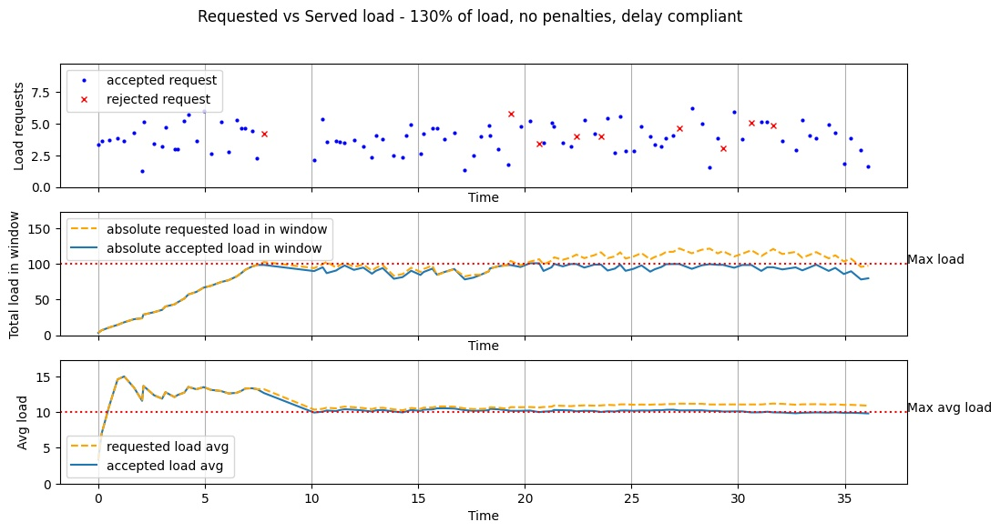

## Goll, a Go Load Limiter


[](http://godoc.org/github.com/fabiofenoglio/goll)
[](https://goreportcard.com/report/github.com/fabiofenoglio/goll)
[](https://circleci.com/gh/fabiofenoglio/goll/tree/main)
[](https://coveralls.io/github/fabiofenoglio/goll?branch=main)

A highly configurable, feature-packed, load-aware limiter for Go.

- [Features](#features)
- [Load limiter vs rate limiter](#load-limiter-vs-rate-limiter)
- [Quickstart](#quickstart)
- [Synchronizing multiple instances](#synchronizing-multiple-instances)
- [Uncompliance penalties](#uncompliance-penalties)
- [Composite limiters](#composite-limiters)
- [Gin-Gonic middleware](#gin-gonic-middleware)
- [Performances](#performances)
- [Examples](#examples)

## Features

- Sliding window/buckets algorithm for smooth limiting and cooldown
- Handles multi-tenancy by default
- Limit amount of 'load' instead of simply limiting the number of requests by allowing load-aware requests
- Support for automatic retry, delay or timeout on load submissions
- Automatically compute RetryIn (time-to-availability) to easily give clients an amount of time to wait before resubmissions
- Configurable penalties for over-max-load requests and for uncompliant clients who do not respect the required delays
- Synchronization adapters for clustering
- Composite load limiter to allow for complex load limiting with a single instance (eg. long-time rate limiting together with burst protection)
- Configurable window fragmentation for optimal smoothness vs performance tuning
- Dedicated Gin-Gonic middleware
- Thread safe

## Load limiter vs rate limiter

A standard rate limiter will count and limit the amount of requests during a fixed amount of time. While useful, sometimes this is not enough as not all requests are equal.

Load balancing works on the concept of _load-weighted requests_: different requests get assigned an arbitrary amount of "load score" and the total load gets limited instead of the number of requests.

Think of your REST API: maybe you don't want to limit the GET /ping endpoint in the same way you limit your POST /heavy-operation or your GET /fetch-whole-database<sup>[1]</sup> endpoint.

By assigning those endpoints a different load score you can get a limiting policy that is effective for defending your system against abuse, but also not too limiting and adapting to different clients' needs.

Note that assigning "1" as load score for all requests you can use it as a standard rate limiter.

<sub><sub>[1] put down the gun I was kidding</sub></sub>

## Quickstart

Get the module with:

```bash
go get github.com/fabiofenoglio/goll
```

Basic usage boils down to creating an instance and calling its `Submit` method with a tenantKey and an arbitrary amount of load.

Please check out the full [quickstart document](docs/quickstart.md).

```go
limiter, _ := goll.New(&goll.Config{
    MaxLoad:           1000,
    WindowSize:        20 * time.Second,
})

res, _ := limiter.Submit("tenantKey", 1)

if res.Accepted {
    fmt.Println("yeee")
} else {
    fmt.Println("darn")
}
```

Note that you don't have to handle multitenancy [if you don't need to](docs/quickstart.md#single-tenant-usage).


## Synchronizing multiple instances

In order to handle heavy loads you will probably be scaling horizontally.

The load limiter is able to quickly work in such a scenario by synchronizing live load data across all the required instances using the channel you prefer.

A sample implementation is provided to synchronize via a Redis instance but you could write your own adapter for memcached, any database, an infinispan cluster and so on.

Please see the [synchronization page](docs/synchronization.md) for a full explanation and some examples.

```go
// provided adapter for synchronizing over a Redis instance
adapter, _ := gollredis.NewRedisSyncAdapter(&gollredis.Config{
    Pool:      goredis.NewPool(goredislib.NewClient(&goredislib.Options{
        Addr:     "localhost:6379",
    })),
    MutexName: "redisAdapterTest",
})

limiter, _ := goll.New(&goll.Config{
    MaxLoad:           1000,
    WindowSize:        20 * time.Second,
    // just plug the adapter here
    SyncAdapter:       adapter,
})
```

## Uncompliance penalties

The limiting policy can be tuned in order to penalize clients for hitting the load limit and/or penalize clients that send an excessive number of requests and do not comply with the required delays.

With a couple parameters you can easily provide a better protection for your system that also encourages compliance and further limits uncompliant clients.

See the [penalties page](docs/penalties.md) for an in-depth explanation, or the [performances page](docs/performances.md#excessive-load-some-penalties-good-client) for a visual demonstration of the effect of penalties.

```go
limiter, err := goll.New(&goll.Config{
    MaxLoad:                                  100,
    WindowSize:                               20 * time.Second,

    // apply penalization when the load limit is reached
    OverstepPenaltyFactor:                    0.20,
    OverstepPenaltyDistributionFactor:        0.25,

    // apply penalization when client is not complying with required delays
    RequestOverheadPenaltyFactor:             0.33,
    RequestOverheadPenaltyDistributionFactor: 0.25,
})
```

## Composite limiters

It is often useful to combine multiple constraints on the acceptable load.

For instance you may want to limit the maximum load your system can handle every minute but you'd also like to limit the load per second in order to protect against sudden request bursts.

See the [composition page](docs/composition.md) for a full explanation or the [performances page](docs/performances.md#excessive-load-and-burst-requests) for a graphic illustration explaining how composition can be useful.

```go
limiter, _ := goll.NewComposite(&goll.CompositeConfig{
    Limiters: []goll.Config{
        {
            // limit max load for each minute
            MaxLoad:           100,
            WindowSize:        60 * time.Second,
        }, 
        {
            // also limit load per second against request bursts
            MaxLoad:           10,
            WindowSize:        1 * time.Second,
        },
    },
})
```

## Gin-Gonic middleware

A separate module is available to plug the limiter as a Gin middleware.

Please check out the [gin-goll repository](https://github.com/fabiofenoglio/gin-goll).

```go
limiter, _ := goll.New(&goll.Config{
    MaxLoad:           100,
    WindowSize:        3 * time.Second,
})

ginLimiter := gingoll.NewLimiterMiddleware(gingoll.Config{
    Limiter: limiter,
    DefaultRouteLoad: 1,
    TenantKeyFunc: func(c *gin.Context) (string, error) {  
        return c.ClientIP(), nil // we'll limit per IP
    },
    AbortHandler: func(c *gin.Context, result goll.SubmitResult) {
        if result.RetryInAvailable {
            c.Header("X-Retry-In", fmt.Sprintf("%v", result.RetryIn.Milliseconds()))
        }
        c.AbortWithStatus(429)
    },
})

r := gin.Default()

// plugin the load limiter middleware for all routes like this:
r.Use(ginLimiter.Default())

// or on single route
r.GET("/something", ginLimiter.Default(), routeHandler)

// specify per-route load
r.POST("/create-something", ginLimiter.WithLoad(5), routeHandler)
r.PUT("/update-something", ginLimiter.WithLoad(3), routeHandler)

// on route group with specific load
r.Group("/intensive-operations/").Use(ginLimiter.WithLoad(10))
```

## Performances

You can check out the [performances page](docs/performances.md) for graphics illustrating performances in a variety of common scenarios.

130% vs standard limiter | 130% vs limiter with penalties | 150% vs standard limiter | 150% vs composite limiter
:-------------------------:|:-------------------------:|:-------------------------:|:-------------------------:
  |   |   |  

The limiter overhead and its memory requirements are very small:

```
goos: windows
goarch: amd64
pkg: github.com/fabiofenoglio/goll
cpu: Intel(R) Core(TM) i7-9700KF CPU @ 3.60GHz
BenchmarkSubmit50pc-8          	 7575757	       159.6 ns/op	      81 B/op	       3 allocs/op
BenchmarkSubmitAllAccepted-8   	 8715760	       139.4 ns/op	      73 B/op	       3 allocs/op
BenchmarkSubmitAllRejected-8   	 7199920	       166.3 ns/op	      88 B/op	       4 allocs/op
```

## Examples

You can check out some [example programs](https://github.com/fabiofenoglio/goll-examples).
