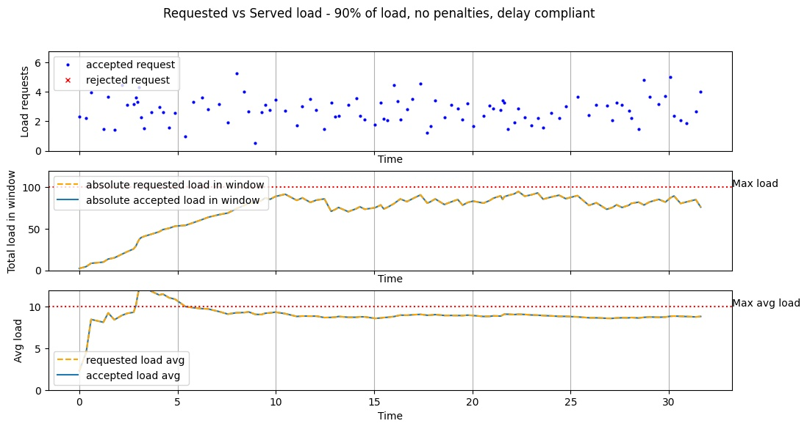
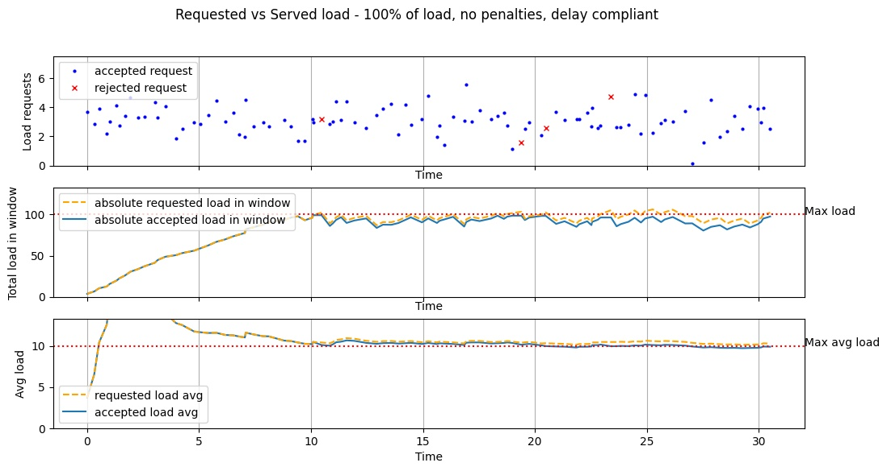
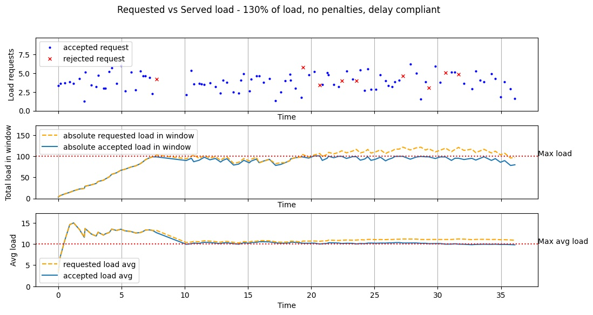
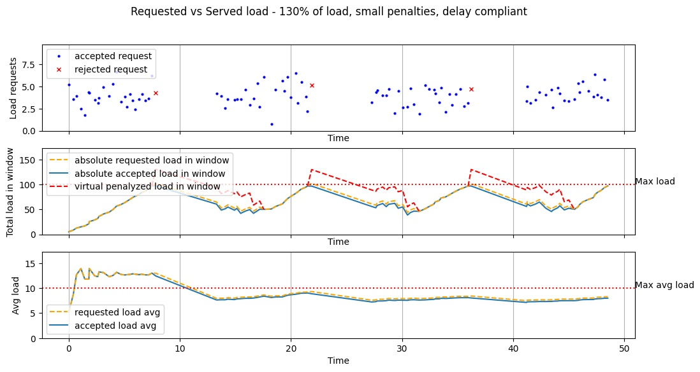
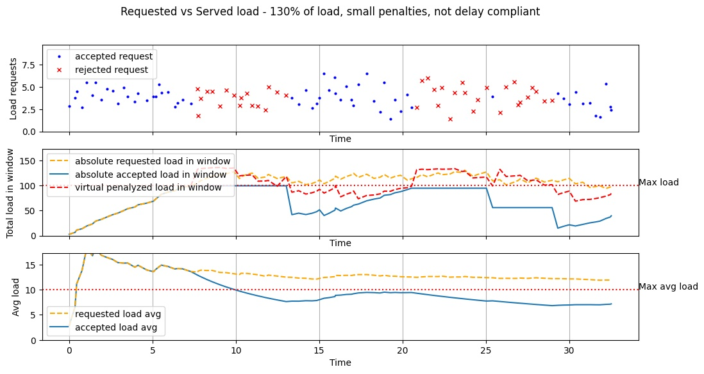
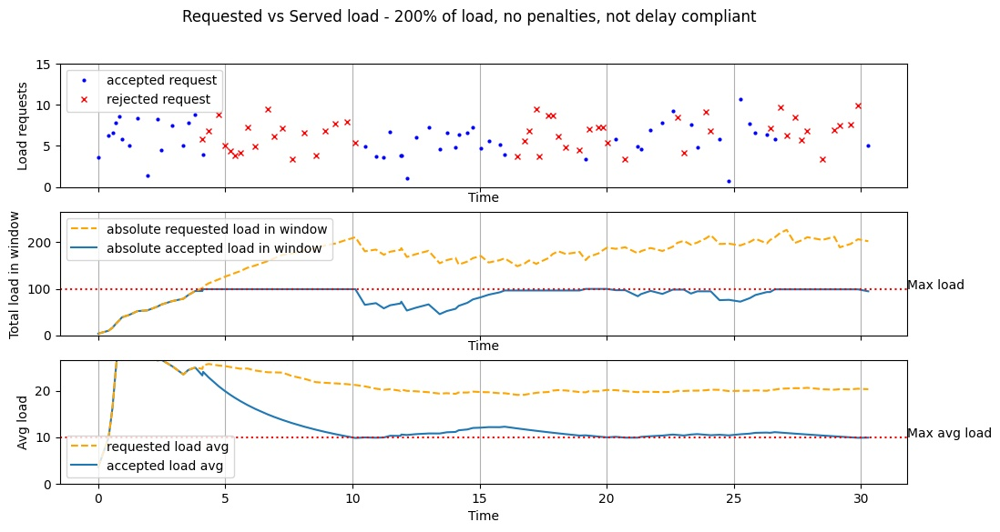
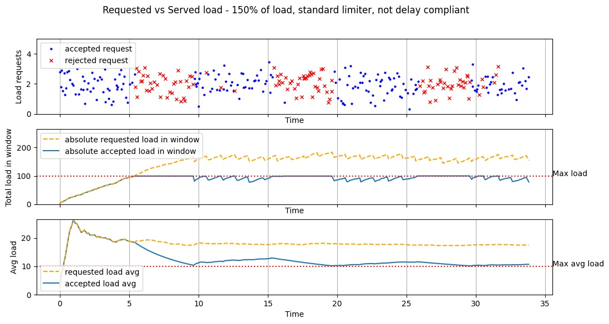
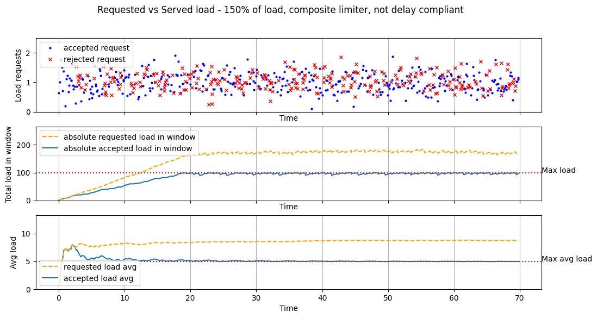

# Performances

Here's some fancy graphs to demonstrate how the limiter works on various configurations and against various clients.

- [Low requested load](#low-requested-load)
- [Max load, good client](#max-load-good-client)
- [Excessive load, good client](#excessive-load-good-client)
- [Excessive load, some penalties, good client](#excessive-load-some-penalties-good-client)
- [Excessive load, some penalties, uncompliant client](#excessive-load-some-penalties-uncompliant-client)
- [Very high load, no penalties, uncompliant client](#very-high-load-no-penalties-uncompliant-client)
- [Excessive load and burst requests](#excessive-load-and-burst-requests)

### Low requested load

A standard load limiter acting against a client requiring less than the maximum allowed load (about 90%).

As you'd expect, no request gets blocked and everything is nice.

### Max load, good client

A standard load limiter with no penalties against a client requiring about 100% of the maximum load.

A few requests get blocked as the limit is reached; the client complies with the (very small) requested delays and can resume its work almost immediately.

As the client complies with the required delays, the average served load will be optimal (up to 100% as you can see in the graph).

### Excessive load, good client

A standard load limiter with no penalties against a client requiring about 130% of the maximum load.

More requests get blocked as the limit is reached; the client complies with the various requested delays and can resume its work after some time.

As the client complies with the required delays, the average served load will be optimal (up to 100% as you can see in the graph).

### Excessive load, some penalties, good client

A load limiter with small overstep penalties against a client requiring about 130% of the maximum load.

As the maximum load is reached, a few requests are blocked and a penalty is added. This forces a bit longer cooldown on the client. 

The client complies with the requested delays and can resume its work after some time.

The client complies with the required delays, however the added cooldown caused by the penalties means that the average served load will be less than 100% - which means that an over-requesting client will effectively be served a bit less than it would be if it was limiting itself.

### Excessive load, some penalties, uncompliant client

A load limiter with small overstep penalties against a client requiring about 130% of the maximum load. In this simulation the client will **not** comply with the requested delays.

As the maximum load is reached, a few requests are blocked and a penalty is added. This forces a bit longer cooldown on the client. 

here the client does **not** comply with the requested delays: he sends more requests instead of waiting, and this causes even more cooldown to accumulate.

The accumulating cooldown means that more requests are rejected and the baseline "virtual" load is higher: the uncompliant client is being effectively limited to a served load significantly lower than it would be if it was limiting itself and compyling with the requested delays.

### Very high load, no penalties, uncompliant client

A standard load limiter with no penalties against a client requiring a lot more (about 200%) of the maximum load.

A lot of requests get blocked as the limit is reached; here the client does **not** comply with the various requested delays and keeps sending requests: you can see that a lot of requests are blocked this way.

However, no penalties are configured, so the client doesn't get penalized for being greedy and the effective served load will be about 100% of the maximum allowed.

### Excessive load and burst requests

Let's demonstrate a particular case where the client is requesting a lot of load (about 150% of the maximum allowed) **and** it's doing so with repeated request bursts.

With a standard limiter we would see something like this:

Not really that great. Notice how requests get rejected for long time windows because the unlimited burst requests are filling the allowed load in the window immediately so it takes a long time for it to cool down.

Also, the served load has a nasty spikey pattern.

This is were a composite limiter gets useful:

### Excessive load and burst requests vs composite limiter

Let's run this client against a composite limiter, limiting both long-time load over 10 seconds **and** short-time load over a single second.

Much better: you can see a lot of omogenously "distributed" rejected requests where the second composed limiters is proving to be useful.

Also, the served load is almost constant and no longer full of spikes.

