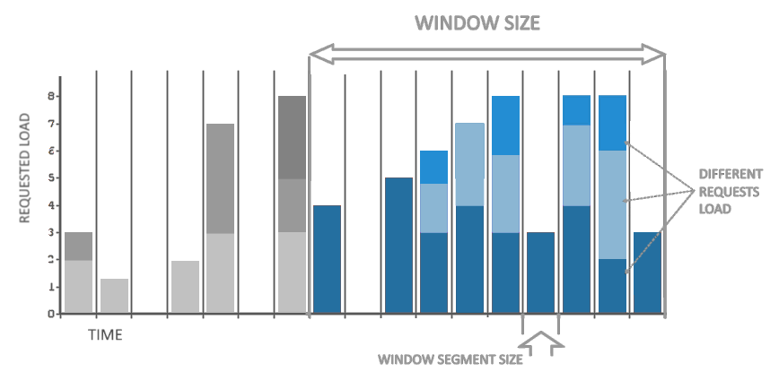

# Quickstart

- [Get the module](#get-the-module)
- [Create a LoadLimiter instance](#create-a-loadlimiter-instance)
- [Query the instance to accept or reject operations](#query-the-instance-to-accept-or-reject-operations)
- [Retry on rejections](#retry-on-rejections)
- [Automatic delay, resubmission and timeout](#automatic-delay-resubmission-and-timeout)
- [Single-tenant usage](#single-tenant-usage)
- [Probe for availability](#probe-for-availability)

### Get the module

Get the module by running:

```bash
go get github.com/fabiofenoglio/goll
```

### Create a LoadLimiter instance

Use the `New` function to create an instance. 

The following example creates a limiter accepting a maximum load of 1000 over a window of 20 seconds:

```go
limiter, err := goll.New(&goll.Config{
    MaxLoad:           1000,
    WindowSize:        20 * time.Second,
})

if err != nil {
    panic(err)
}
```

The MaxLoad and WindowSize parameters are required. A graphical explanation of the Window configuration parameters is in this picture:



The WindowSegmentSize parameter is optional and has a default value dividing the window in 20 segments.

The smaller the segment size, the smoother the limiting will be.
However, making the segments too small will increase memory and CPU overhead.
Having about 10 to 20 segments in the window should give you enough smoothness while keeping a low overhead.

### Query the instance to accept or reject operations

Use the `Submit` method to accept or reject operations.

The required parameters are the tenantKey (as the limiter works in multitenant mode by default)
and the requested load amount.

The return value of the `Submit` method has an `Accepted` field which will be true if the request was accepted or false if rejected.

```go
res, _ := limiter.Submit("tenantKey", 1)

if res.Accepted {
    fmt.Println("yeee")
} else {
    fmt.Println("darn")
}
```

If you don't need to handle multitenancy, please refer to [Single-tenant usage](#single-tenant-usage)

### Retry on rejections

In case of rejection a retry may be allowed after a delay. If the `RetryInAvailable` output field is true, the `RetryIn` output field will contain the minimum `time.Duration` the client must wait before the required load will be available.

You could easily use this field, for instance to return a 429 HTTP response from a web server together with a requested delay.

```go
res, _ := limiter.Submit("tenantKey", 5)

if res.Accepted {
    fmt.Println("yeee")

} else if res.RetryInAvailable {

    fmt.Printf("request was rejected, asked to wait for %v ms \n", res.RetryIn.Milliseconds())

    // wait the required amount of time
    time.Sleep(res.RetryIn)

    // resubmit after waiting
    res, _ = limiter.Submit("tenantKey", 5)
    if res.Accepted {
        fmt.Println("resubmitted request for load was accepted")

    } else {
        panic("waited the required amount of time but the request was rejected")
    }

} else {
    fmt.Println("request was rejected with no retry allowed")
}
```

If you don't plan on using the `RetryIn` field you can disable it by passing `SkipRetryInComputing` to the contructor, gaining a slight increase in performance:

```go
limiter, err := goll.New(&goll.Config{
    MaxLoad:                1000,
    WindowSize:             20 * time.Second,
    SkipRetryInComputing:   true,
})
```

### Automatic delay, resubmission and timeout

A `SubmitUntil` method is available to submit a load request and automatically wait and retry if the request is rejected.

The call to `SubmitUntil` will block until the request is accepted or the specified timeout is reached.

```go
// this call will wait up to 10 seconds for the requested load to be available.
err := limiter.SubmitUntil("tenantKey", 1, 10*time.Second)

if err != nil {
    if errors.Is(err, goll.ErrLoadRequestTimeout) {
        fmt.Printf("request was rejected and timed out while retrying (%v)\n", err.Error())
    } else {
        fmt.Printf("request failed (%v)\n", err.Error())
    }
} else {
    fmt.Printf("request was accepted\n")
}
```

### Single-tenant usage

If you don't need to handle multitenancy you can switch to a single-tenant proxy interface
that will drop the tenantKey parameter and make the code easier and cleaner.

Just call the `AsSingleTenant` method:

```go
newLimiter, _ := goll.New(&goll.Config{
    MaxLoad:                1000,
    WindowSize:             20 * time.Second,
})

// switch to single tenant mode
limiter := newLimiter.AsSingleTenant()

// you can now submit/probe without tenant key
res, _ := limiter.Submit(1)

```

If you still need to handle multitenancy but could use a reference that
works on a fixed tenantKey for a while, you can leverage the `ForTenant` method:

```go
newLimiter, _ := goll.New(&goll.Config{
    MaxLoad:                1000,
    WindowSize:             20 * time.Second,
})

// create a proxy for a fixed tenant key
limiterForTenant1 := newLimiter.ForTenant("tenant1")

// you can now submit/probe without specifying tenant key
res, _ := limiterForTenant1.Submit(1)
// this is exactly the same of newLimiter.Submit("tenant1", 1)
```

### Probe for availability

A `Probe` method is available to check wether an amount of load would be available. This method is not modifying and does not increment the current tracked load or apply rejection penalties.

This is useful for instance to check if the system is currently overloaded.

```go
available, _ := limiter.Probe("tenantKey", 1)
if !available {
    fmt.Println("No available load for this tenant")
}
```

**NOTE:** do not use `Probe` to check for availability before `Submit` as you may create a race condition.

Use `Submit` directly instead.